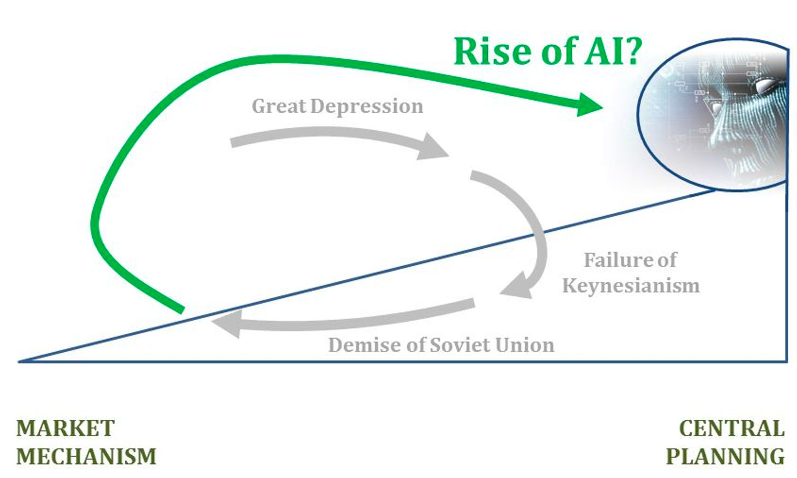

##Can Computer Plan You？聊聊推荐系统与计划经济的复兴

这篇文章基于《激进市场》（*Radical Markets: Uprooting Capitalism and Democracy for a Just Society*）附录中的讨论，以推荐系统为例，聊一聊人工智能（AI）如何改变了市场经济模式。

####活动预告
本文是周末706机器学习小组同名分享活动的前言。活动时间为美东时间7.19早上十点（北京时间7.19晚上十点），在腾讯会议举办。在本文的内容之外，我将结合**数据即劳工**的话题，谈一谈人工智能背景下数据的边际价值，以及它对数据产权的规则制定有什么启示。最后，我会结合我自己的擅长领域，简要地讲一讲商用推荐系统用到的方法、理论和学术界的前沿研究。正文从这里开始：

###为什么推荐系统标志着计划经济的再次兴起？
过去的六十年，全球范围内经历了计划经济的衰落和市场经济的繁荣，例如凯恩斯主义的失败和苏联的解体。究其原因，有的经济学家认为市场为个人的劳动提供了更好的激励机制。但是，以行政规划、赏罚分明而闻名的计划经济在这方面并不如他们所说：利用恐惧和贪婪的行政的系统至少让工人们不敢消极怠工。因而这并不是一个最靠谱的理由。

1945年，经济学家哈耶克提到：计划经济无法对每个个体对商品的独特需求和个人偏好做出反应。基于此，经济学家Ludwig von Mises提出了以下观点，也是本文所基于的一个假设：
```
计划经济的基本的问题是计算（communication）和沟通（computation）成本。
```




还记得高中时的线性规划问题吗？上图是一个简单的示例。我们想要求得z最小时x1和x2的值，同时需要满足“subject to”后面的条件。这种优化问题可以用计算机程序快速得到结果。

在我们可以想象的理性假设下，经济系统本身可以被写成一个这种形式的极其复杂的优化问题，变量包括了需求、供给和时间以及亿万商品、人员和服务；目标函数包括了每个参与经济的个人的收益、商品与货币流通的效率、当下收益与未来收益等等。

若如此，经济问题就变成了怎样高效地针对优化问题“求解“出一个分配方案，即规定每个生产者、消费者和投资者在参与经济时的行为，以达目标函数的最大化。

**Q: 我们怎样“求解”经济系统？**

对求解的过程，计划经济和市场经济给出了不同的解决方案：

- 计划经济：用一个中心化的超级电脑求解。
- 市场经济：用分布式计算（distributed computing）和并行处理（parallel processing）的方式来解决这个方程组。每个人相当于一个并行的处理器。

在这种情境下，市场经济之所以胜过中央分配，是因为每个个体（人脑+便携设备）在特定的场景中感知环境、处理复杂信息、计算收支的能力都胜过了超级电脑。当所有人都在并行地处理这些信息时，更不是一个强大的中央处理器所能比拟的。在当时的条件下，当苏联领导人认为靠着克林姆林宫里少数人的官僚体系就能管理庞大复杂的经济时，便注定了要落后于计算效率更加强大的市场经济体系。

在自由市场经济中，每个人扮演了局部信息的收集者和处理者的角色。一个人不需要像超级电脑那样收集和处理市场上所有的信息，但是可以对他周边的信息进行整理和做出决策。例如一个超市会根据周围小区对各类食品、生活用品的需求量以及自己掌握的供给来制定合适的价格。对小区消费者而言，他们仅仅需要信任价格，而不需要了解背后的庞杂信息和决策过程，就可以制定消费决策。如果价格不合理，他们就会转向别的卖家。


单个行业之内通过价格的交易

不同行业间基于同一价格标准的交易 
Source: How The Economic Machine Works by Ray Dalio (https://www.youtube.com/watch?v=PHe0bXAIuk0&t=37s)
如同Ray Dalio的视频截图中所展示的，在这个过程中，个体之间基于价格的交易是构成了经济的基本单位。关于同种商品（例如玉米）的交易构成了这个行业的经济活动。同一个价格标准继而又作为行业之间的交易标准，带动了整个经济引擎的运转。在这个体系中，每个个体仅需要处理局部信息不用承担太大的计算量(local computation)，同时个体之间通过价格的沟通也最小化了沟通成本(minimizubg communication)。这与分布式系统中的peer to peer system类似。

Q: 如果社会中设备的计算能力超过了所有的人脑计算能力，会发生什么？

摩尔定律指的是值在给定的成本下，芯片的集成程度和计算能力每十八个月翻一倍。虽然该定律在芯片领域趋近物理极限，有饱和的可能，但是软件、编译和AI等领域却依然有着快速的迭代发展。

用我熟悉的AI领域举例。下图是openAI发布的自2012到2018年计算力变化的统计。自从2012年起，训练最大的AI模型所需的计算量成指数增长，且翻倍的时间为3.4个月（摩尔定律为18个月）。从2012年的AlexNet（图像分类竞赛冠军）到2018年的AlphaZero（围棋世界冠军），这项指标已经增长了300,000倍。计算力的进步让人工智能模型的复杂度得以不断提高，从而在越来越艰难的任务上取得与人类相当的表现。


时间（横轴）与训练当下最大的AI模型所需的计算量（纵轴）。数值越高，模型的计算成本就越高
与此同时，如下图所示，深度学习模型的效率也在提高，表现在达到同样表现水平所需要的计算量逐年减少。从2012年到2019年，要达到AlexNet在图像识别上的准确率，所需要的浮点运算次数减少了44倍，这相当于算法的效率每16个月翻一番。


时间（横轴）与达到AlexNet表现水平所需要的计算量（数轴）。数值越低，模型的计算效率越高。
这种AI模型在现实中的例子是中心化计算在电商公司中的应用。在亚马逊和阿里的商业系统中，生产、后勤、组织、分销、供应链的管理依靠了大规模中心化计算来实现高度自动化，部分代替了以往靠人际交流的模式，而自动化程度更低一些的沃尔玛、大润发等线下商城则被淘汰或者被迫转型。与此同时，google利用人工智能实现更精确的搜索结果和定制化广告投放，Uber利用则实现了实时智能交通规划和预测。

总结来说，计算机领域的趋势是算力和模型效率的快速增长，在未来会在更多有挑战性的任务上超过人脑的计算能力。与此同时，AI模型在自由市场中成就了一个个高度自动化的等级商业组织。我们不禁要问，当计算机的算力超过人脑时，是否意味着用中央计划模式来规划人的行为，会比自由市场更高效？

Q: Can Computer Plan You?

回到这篇文章的标题所提出的问题。除了优化商业组织之外，计算机能否用来求解经济系统的目标函数，来规划人们该在什么时候买什么商品，做什么工作，投资什么项目？

至少在消费方面，现有的大规模机器学习系统在积极地朝着这个方向发展。以商用推荐系统为例，以下是几个我们在生活中常见的例子：

-      电子商务：某宝的相关商品；你可能感兴趣的商品

-      搜索引擎：广告商的链接推送；你可能会感兴趣的其他搜索关键词

-      内容推送：今日头条的相关短视频推送

-      社交推荐：微博中你可能喜欢的大V推送

-      论坛推荐：知乎推送的精选问题和答案

推荐系统如何是否要给用户（user）推荐某一个作品/产品（item）呢？用影片评分网站举例：系统选择是否要把电影DeadPool（《死侍》）推荐给你时，一个智能的决策过程应该思考以下问题：1. 你对类似电影的打分情况怎样？2. 与你有着类似打分历史的人对这部影片的评价怎样？3.这部影片是否与你过去喜欢的某个影片有联系性？比如由同一个人主演、导演或编剧？4.现实中你的某个好朋友是否也喜欢它？

这些基于常理的假设被研究人员应用在了AI模型的设计当中，进而利用平台积累的用户数据来训练模型。

推荐系统的目标函数除了优化用户和商品匹配的效率之外，还有以下目的：

优化点击率。即增加用户看到推送时点击的概率；
增加平台收入。比如投放广告的收入和每笔达成交易的提成。这方面主要体现的是不同公司的业务逻辑。

Source: tutorial at WSDM 2020 (https://next-nus.github.io/slides/tuto-cikm2019-public.pdf )
实际应用时，如上图所示，模型在APP运行的时候实时基于某个用户信息(user contexts)的和海量商品信息(item corpus)，挑选出用户最可能感兴趣的几百个candidate，经过排序的步骤(ranking)将最终结果(items of interest)展现在用户的界面。

分享内容
在美东时间7.19早上十点（北京时间7.19晚上十点）的分享中，我将继续这篇文章的讨论，并且基于这份slides简要地概述推荐系统的基本原理、方法和前沿研究，结合我的研究领域（图神经网络）讲讲建立在上述假设之上的推荐系统模型（不要被长度吓到，只会cover一部分）。

The Dark Side

推荐系统的成功是建立在我们为平台免费贡献的搜索记录、视频文章评分、社交关系、商品评论之上的。可以说，是我们用户成就了百度、头条、腾讯和阿里商业上的成功。然而为什么我们却不能得到相应的报酬？在最后一部分，我会从我将从推荐系统问题延伸开去，在时间允许的范围内与大家探讨在更广泛的AI产业下，数据产权的相关问题，包括：

数据的边际价值
数据即劳工：贡献浏览历史和数据标注的报酬
人工智能系统中目标函数的制定：谁来制定，为谁服务？
制度思想实验：如何避免一个赛博朋克式的，穷人与富人分处地狱和天堂的数字社会？
期待周日的讨论！


引用：

[1] Amodei, D. & Hernandez, D. (2018-05-16) “AI and Compute.” OpenAI.com.

[2] Hernandez, Danny, and Tom B. Brown. "Measuring the Algorithmic Efficiency of Neural Networks." arXiv preprint arXiv:2005.04305 (2020).

[3] Posner, Eric A., and E. Glen Weyl. Radical markets: Uprooting capitalism and democracy for a just society. Princeton University Press, 2018.

[4] Wang, Xiang, Xiangnan He, and Tat-Seng Chua. "Learning and Reasoning on Graph for Recommendation." Proceedings of the 13th International Conference on Web Search and Data Mining. 2020.